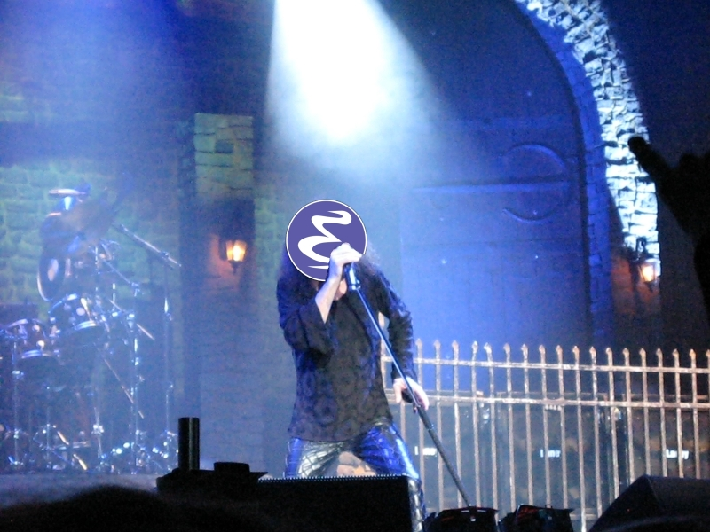
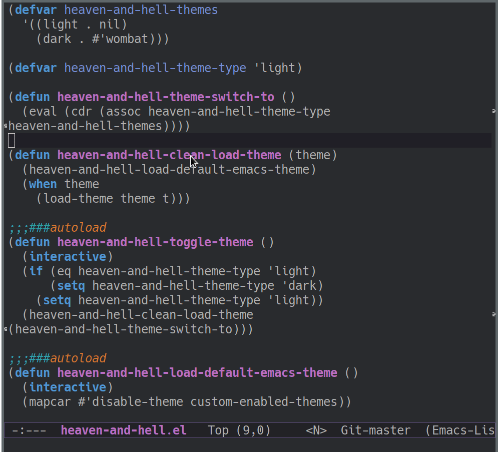

# Heaven and Hell [](https://www.gnu.org/software/emacs/) [](https://www.gnu.org/software/emacs/) [](https://www.gnu.org/software/emacs/)



Heaven and Hell - emacs package for easy toggling of light/dark color themes.

## TLDR:



## Why?

I constantly switch light and dark theme.
When it's sunny outside, or I work in a very light room - I use the light theme.
Otherwise, I prefer dark one.
So I wrote a bunch of helpers which helped me with this and one day I decided to make a package out of it.
Hope it'll be useful to anybody else. Cheers!

## Features

* Define your favorite light and dark themes
* Choose which one to run by default
* Switch between them with a single keypress
* Easily roll back to default emacs theme in case of messed faces

## Installation

Heaven and Hell is not yet in melpa. I'm working on that, but for now you have to install it from my repo.

### With `use-package` or manual

First clone the repo:

```shell
git clone https://github.com/valignatev/heaven-and-hell.git your/site/elisp/path
```

Manually:

```emacs-lisp
(require 'heaven-and-hell "your/site/elisp/path/heaven-and-hell/heaven-and-hell.el")
```

With `use-package` (including example config):
```emacs-lisp
(use-package heaven-and-hell
  :load-path "your/site/elisp/path/heaven-and-hell"
  :init
  (setq heaven-and-hell-theme-type 'dark) ;; Omit to use light by default
  (setq heaven-and-hell-themes
	'((light . #'tsdh-light)
	  (dark . #'tsdh-dark)))
  :hook (after-init . heaven-and-hell-init-hook)
  :bind (("C-c <f6>" . heaven-and-hell-load-default-emacs-theme)
	 ("<f6>" . heaven-and-hell-toggle-theme)))
```

### With `straight.el`

```emacs-lisp
(straight-use-package
 '(heaven-and-hell :type git :host github :repo "valignatev/heaven-and-hell"))
```

## Example configuration

For `use-package` configuration look above in installation section

```emacs-lisp
;; Default is 'light
(setq heaven-and-hell-theme-type 'dark)

;; Set preferred light and dark themes
;; default light is emacs default theme, default dark is wombat
(setq heaven-and-hell-themes
      '((light . #'tsdh-light)
	(dark . #'tsdh-dark)))

;; Add init-hook so heaven-and-hell can load your theme
(add-hook 'after-init-hook 'heaven-and-hell-init-hook)

;; Set keys to toggle theme and return to default emacs theme
(global-set-key (kbd "C-c <f6>") 'heaven-and-hell-load-default-emacs-theme)
(global-set-key (kbd "<f6>") 'heaven-and-hell-toggle-theme)
```

## Contribution

Feel free to open issue, submit pull request or share it anywhere in the Internet :)

## License

MIT
